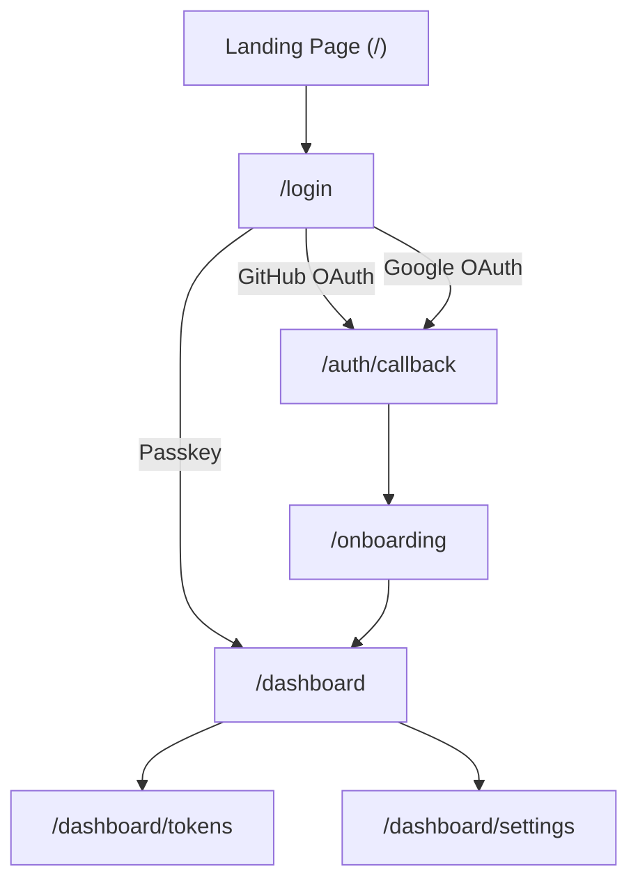
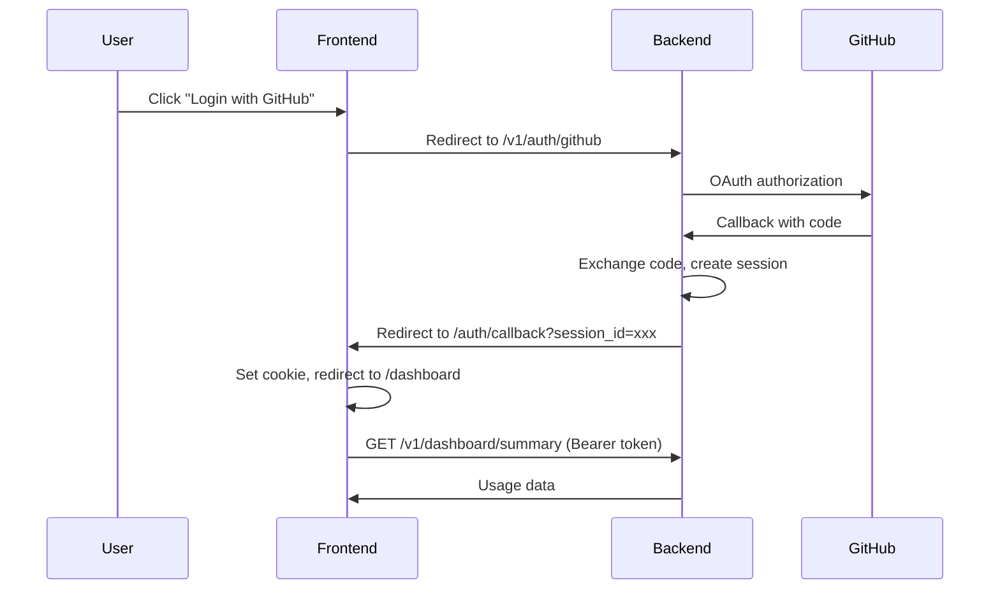

# BurnGuard Dashboard

The web frontend for [BurnGuard](https://burnguard.run) — a real-time AI API cost tracking dashboard.

## Stack

| Layer | Choice |
|-------|--------|
| Framework | Next.js 15 (App Router) |
| Language | TypeScript (strict) |
| Styling | Tailwind CSS v4, custom components |
| Animations | GSAP (landing page), CSS transitions (dashboard) |
| Charts | Recharts |
| Data Fetching | TanStack Query v5 |
| Icons | Custom SVG components |
| Forms | React Hook Form + Zod |
| Notifications | Sonner |
| Passkeys | @simplewebauthn/browser |

## Pages



| Route | Purpose | Auth |
|-------|---------|------|
| `/` | Marketing landing page | Public |
| `/login` | Sign in (GitHub, Google, Passkey) | Public |
| `/auth/callback` | OAuth redirect handler, sets session cookie | Public |
| `/onboarding` | First-time setup wizard | Protected |
| `/dashboard` | Spend overview, charts, request log | Protected |
| `/dashboard/tokens` | Create and manage sync tokens | Protected |
| `/dashboard/settings` | Profile, budget, alerts, auth methods | Protected |

## Project Structure

```
src/
├── app/                        # Next.js App Router pages
│   ├── page.tsx                # Landing page
│   ├── login/page.tsx          # Authentication
│   ├── auth/callback/page.tsx  # OAuth callback handler
│   ├── onboarding/page.tsx     # First-time setup
│   └── dashboard/
│       ├── page.tsx            # Main dashboard
│       ├── layout.tsx          # Sidebar + topbar layout
│       ├── tokens/page.tsx     # Sync token management
│       └── settings/page.tsx   # Account settings
├── components/
│   ├── icons/                  # Custom SVG icon components
│   ├── landing/                # Landing page sections
│   ├── dashboard/              # Dashboard-specific components
│   └── ui/                     # Reusable primitives (button, input, modal, etc.)
├── hooks/
│   ├── use-auth.ts             # Auth state and login helpers
│   ├── use-dashboard.ts        # Dashboard data queries
│   ├── use-tokens.ts           # Token CRUD operations
│   ├── use-budget.ts           # Budget get/update
│   └── use-alerts.ts           # Alert config get/update
├── lib/
│   ├── api.ts                  # API client with session auth
│   ├── passkey.ts              # WebAuthn registration and login
│   ├── gsap.ts                 # GSAP setup and helpers
│   ├── types.ts                # Shared TypeScript interfaces
│   ├── utils.ts                # Formatters and helpers
│   └── constants.ts            # API URL, app config
├── providers/
│   ├── query-provider.tsx      # TanStack Query provider
│   └── theme-provider.tsx      # Dark/light mode provider
└── proxy.ts                    # Next.js middleware for route protection
```

## API Integration

The dashboard communicates with the backend at `api.burnguard.run`. Authentication uses session IDs sent as Bearer tokens in the Authorization header.



### Endpoints Used

```
GET  /v1/auth/me                    — Current user profile
GET  /v1/dashboard/summary          — Total spend, requests, tokens
GET  /v1/dashboard/chart?days=30    — Daily spend for chart
GET  /v1/dashboard/providers        — Spend by provider
GET  /v1/dashboard/requests?limit=20 — Recent request log
POST /v1/tokens                     — Create sync token
GET  /v1/tokens                     — List sync tokens
GET  /v1/budget                     — Get budget limit
PUT  /v1/budget                     — Update budget limit
GET  /v1/alerts/config              — Get alert settings
PUT  /v1/alerts/config              — Update alert settings
POST /v1/auth/passkey/register/*    — Passkey registration (2-step)
POST /v1/auth/passkey/login/*       — Passkey login (2-step)
```

## Development

### Prerequisites

- Node.js 20+
- Backend API running on `localhost:3001`

### Setup

```bash
npm install
npm run dev
```

Open [http://localhost:3000](http://localhost:3000).

### Environment Variables

Create `.env.local`:

```
NEXT_PUBLIC_API_URL=http://localhost:3001
NEXT_PUBLIC_APP_URL=http://localhost:3000
```

### Production

```
NEXT_PUBLIC_API_URL=https://api.burnguard.run
NEXT_PUBLIC_APP_URL=https://burnguard.run
```

## Design System

### Theme

Dark mode is the default. Light mode available via toggle. System preference detected on first visit.

### Colors

```
Accent:  #E8652D (burnt orange)
Success: #22c55e
Warning: #f5a623
Danger:  #ef4444
```

### Typography

- UI text: Inter / system sans-serif
- Numbers, costs, tokens, code: JetBrains Mono / monospace

### Key UX Details

- Costs display 4 decimal places in tables (`$0.0003`), 2 in stat cards (`$47.23`)
- Token counts abbreviate above 10K (`12.4K`, `2.1M`)
- Timestamps show relative time (`2 min ago`), full date on hover
- Budget progress bar changes color: green under 50%, amber 50-80%, red above 80%
- Sync token reveal modal cannot be dismissed without copying or acknowledging

## Deployment

Deployed on Vercel. Pushes to `main` auto-deploy.

```bash
# Manual deploy
vercel --prod
```

Domain: [burnguard.run](https://burnguard.run)

---

Part of the [BurnGuard](https://github.com/Verifieddanny/BunGuard) project.